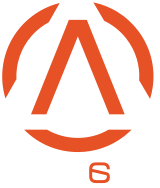

<div align="center">
  <h1>arkaans</h1>
  

### <p><em>The hub where it all began.</em></p>


</div>

---

## À propos

**[www.arkaans.com](https://www.arkaans.com)** est le hub central de l'écosystème Arkaans — une page d'accueil minimaliste et multilingue qui regroupe tous les projets liés à la structure.

Arkaans était une communauté esport française fondée le 10 juin 2014, dissoute en 2017. Ce site en est le vestige numérique et le point d'entrée vers les projets actuels.

---

## Stack technique

| Technologie         | Usage                         |
| ------------------- | ----------------------------- |
| **Next.js 14**      | Framework React (App Router)  |
| **next-intl 3**     | Internationalisation FR / EN  |
| **Tailwind CSS 3**  | Styles utilitaires            |
| **TypeScript 5**    | Typage statique               |
| **Not-Just-Groovy** | Police custom (logo wordmark) |
| **AWS Amplify**     | Hébergement + CD automatique  |
| **GitHub Actions**  | CI (type check + build)       |

---

## Fonctionnalités

- **Page hub single-viewport** — layout `h-dvh` sans scroll sur desktop, responsive mobile (1 colonne)
- **2 cartes principales** — Discord + Arkaans Copilot (projets Arkaans) ; Portfolio et GitHub en footer
- **i18n FR/EN** — FR par défaut (`/`), EN sur `/en`, via `localePrefix: "as-needed"`
- **Logo SVG officiel** — icône + wordmark extraits fidèlement depuis `public/logo.svg`
- **OG image dynamique** — générée via `next/og` (Edge runtime), logo full SVG inline
- **Favicon SVG** — `app/icon.svg` icône Arkaans
- **Sitemap** — `app/sitemap.ts`, soumis à Google Search Console
- **robots.txt** — `app/robots.ts`, autorise tout, pointe vers le sitemap
- **JSON-LD schema.org** — `Organization` avec fondateur, dates, réseaux sociaux
- **Wikidata** — entrée [Q140345205](https://www.wikidata.org/wiki/Q140345205) créée

---

## Structure du projet

```
arkaans/
├── app/
│   ├── [locale]/
│   │   ├── layout.tsx          # Fonts, metadata, JSON-LD
│   │   ├── page.tsx            # Page hub
│   │   └── opengraph-image.tsx # OG image dynamique (Edge)
│   ├── icon.svg                # Favicon
│   ├── sitemap.ts              # Sitemap XML
│   ├── robots.ts               # robots.txt
│   └── globals.css
├── components/
│   ├── icons/
│   │   ├── ArkaansLogo.tsx     # Logo complet (icône + wordmark)
│   │   ├── ArkaansIcon.tsx     # Icône seule
│   │   └── DiscordIcon.tsx
│   ├── HubCard.tsx             # Carte de lien
│   └── LangSwitcher.tsx        # Toggle FR ↔ EN
├── i18n/
│   ├── routing.ts              # Locales + localePrefix
│   ├── request.ts              # getRequestConfig
│   └── navigation.ts           # createNavigation
├── messages/
│   ├── fr.json
│   └── en.json
├── public/
│   ├── logo.svg
│   └── fonts/
│       └── notJustGroovy.woff  # Police runtime (OG image)
├── .github/
│   └── workflows/
│       └── ci.yml              # CI GitHub Actions
└── amplify.yml                 # Config build Amplify
```

---

## CI / CD

```
push → dev  ──→  GitHub Actions CI (type check + build)
PR → main   ──→  GitHub Actions CI
merge → main ──→  AWS Amplify CD (déploiement automatique)
```

Le CI tourne sur Node.js 22 et vérifie :

1. `npx tsc --noEmit` — vérification des types TypeScript
2. `npm run build` — build Next.js complet

---

## Lancer en local

```bash
npm install
npm run dev
```

Ouvre [http://localhost:3000](http://localhost:3000).

---

## Liens

|                 |                                                            |
| --------------- | ---------------------------------------------------------- |
| Site            | [www.arkaans.com](https://www.arkaans.com)                 |
| Arkaans Copilot | [copilot.arkaans.com](https://copilot.arkaans.com)         |
| Portfolio       | [joe.arkaans.com](https://joe.arkaans.com)                 |
| Discord         | [discord.gg/BgRwHfK](https://discord.gg/BgRwHfK)           |
| GitHub          | [github.com/Boutzi](https://github.com/Boutzi)             |
| Merch           | [arkaans.myspreadshop.fr](https://arkaans.myspreadshop.fr) |
| Wikidata        | [Q140345205](https://www.wikidata.org/wiki/Q140345205)     |

---

<div align="center">
  <sub>Arkaans © 2014–2026 — Joseph "Boutzi" Girardi</sub>
</div>
